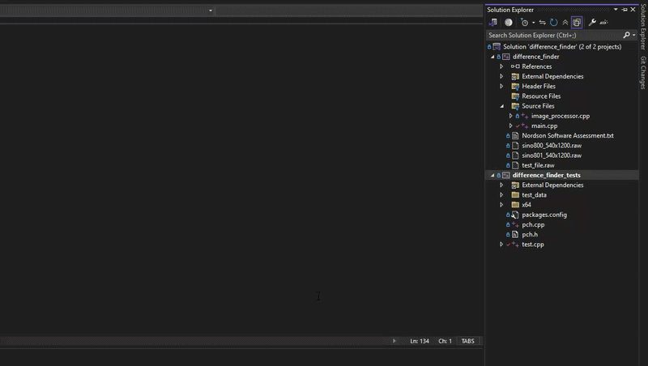
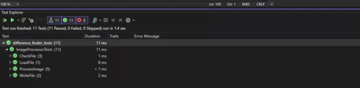
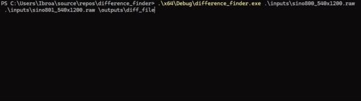

# Difference Finder

A C++ console application that calculates the pixel-wise difference between two `.raw` images and writes the result to a new `.raw` file.

## Overview

The input `.raw` files contain no metadata or headers, just a flat buffer of 16-bit unsigned pixel values. This project reads two such files, computes the absolute difference between corresponding pixels, and writes the result in the same format.

Two implementations are included:
- **Sequential**: a single-threaded diff calculation.
- **Parallel**: diff calculation distributed across multiple threads.

The application detects the number of threads available on the host machine and falls back to the sequential path if multithreading wouldn't help (e.g. on a single-core system).

Built using only standard C++ and Visual Studio 2022. No external dependencies were used, to keep the project easy to build on any machine with a standard C++ toolchain.

## How It Works

1. **Validate and load**: each input file is checked for existence, non-emptiness, and correct byte size before being read into memory as a buffer of `uint16_t` pixel values.
2. **Determine thread count**: the application queries the system for the number of available hardware threads. If that number is unreliable or too low (0 or 1), it falls back to a single-threaded run.
3. **Compute the difference**:
   - *Sequential path:* a single loop computes `abs(pixelA - pixelB)` for every pixel.
   - *Parallel path:* the image is split into contiguous chunks, one per thread. Each thread computes the diff for its own chunk and writes directly into its slice of a shared output buffer, so no locking is required, as no two threads ever write to the same index.
4. **Write the result**: the output buffer is written to a new `.raw` file, with the output directory created automatically if it doesn't already exist.

Errors at any stage (missing files, corrupt data, mismatched sizes, failed writes) are caught and reported with a clear message, and the program exits with a non-zero status rather than crashing.

## Endianness

The sample `.raw` files were visually inspected (converted to `.png` via `stb_image_write`, both in their original byte order and with a manual 16-bit byte-swap applied) to check pixel interpretation. The unmodified data produced a coherent image, while the byte-swapped version showed clear, unnatural high-contrast noise. The data was therefore confirmed to be in native little-endian format, requiring no byte-swapping.

## How to Run the Project

### Downloads & Archive Releases

[Sequential Solution](https://github.com/ibby101/difference_finder/releases/download/submission-release/diff_sequential_sln.zip)

[Parallel Solution](https://github.com/ibby101/difference_finder/releases/download/submission-release/diff_parallel_sln.zip)

### Running Test Cases

1. Extract the source archive and open the solution in Visual Studio 2022.
2. In Solution Explorer, right-click **difference_finder_tests** and select **Set as Startup Project**.
3. Run the tests via **Test > Test Explorer**.

The suite covers file validation, sequential diff correctness (including boundary and symmetry checks), thread-count fallback logic, work-distribution maths (including remainder handling), and parallel diff correctness, verified by comparing parallel output against the trusted sequential result.

3. Run the unit tests via the Test Explorer tab (`Test` > `Test Explorer`).

### Running from Console

The application requires four command-line arguments (including the executable path).

If the arguments do not match the expected format, the application displays a usage guide explaining the required parameters (two input `.raw` files and an output file name):

Providing invalid file types or non-`.raw` files will trigger file validation, outputting a clear error message and exiting gracefully:

On success, a confirmation message is printed showing the output file that was written.

## Declaration of AI Usage

AI was used during this project for guided learning and proofreading documentation. 

## Resources

The following is a list of resources used to understand the required concepts for this project, tools that aided me during the development process, and other features of C++ STL that I've picked up along the way.

- https://boqian.weebly.com/c-programming.html - Bo Qian's C++ Programming Tutorials.
- https://www.eecs.umich.edu/courses/eecs380/HANDOUTS/cppBinaryFileIO-1.html - how to read from a binary file.
- https://www.youtube.com/watch?v=pnoEgNt9B4E - Mike Shah's C++ Tutorials, Read/Write Binary Data in C++, Youtube.
- https://cppreference.com/cpp/filesystem/exists - using filesystem library to perform validation on files.
- https://www.w3schools.com/cpp/ref_fstream_ifstream.asp - fstream for reading raw files.
- https://google.github.io/googletest/primer.html - GoogleTest primer for understanding how to use testing syntax.
- https://www.scs.stanford.edu/05au-cs240c/lab/i386/s02_02.htm - learning about "High Bytes/ Low Bytes" and 16 bits being a "Word".
- https://en.cppreference.com/cpp/filesystem/path/operator_slash - part of `std::filesystem::path`, appends a path segment using the platform's correct separator.
- https://en.cppreference.com/cpp/thread/thread/hardware_concurrency - a useful tool in the `<thread>` library, outputs the number of concurrent threads the active system can support.
- https://www.geeksforgeeks.org/cpp/std-iota-in-cpp/ - std::iota to help fill a vector with values for testing.

